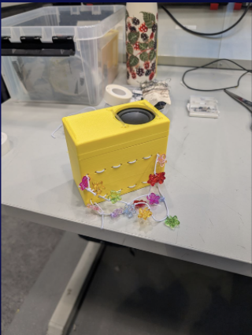
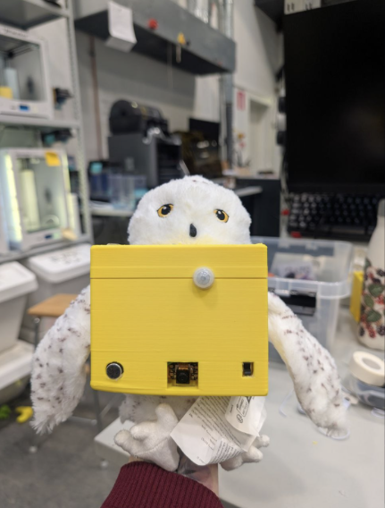
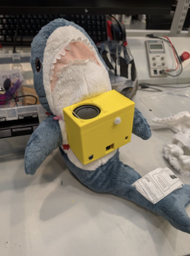

# LullaBuddy

An IoT baby monitor that detects crying and automatically plays lullabies, with real-time alerts sent to a companion mobile app.





## How it works

LullaBuddy runs on a **Seeed XIAO ESP32-S3** and monitors the baby using a PIR motion sensor and an analog microphone. When motion is detected and sustained crying follows, the device streams an MP3 lullaby over I2S audio and notifies parents through a cloud API. After a configurable maximum number of lullabies, it triggers a phone vibration alert instead.

### Detection logic

1. PIR sensor must stay HIGH for 3 seconds to filter out brief movements.
2. Within a 5-second window after motion is confirmed, the microphone is sampled for cry spikes (rapid amplitude changes).
3. If 50 or more spikes are detected, a cry is confirmed.
4. The device plays up to 3 lullabies from the cloud. On the fourth trigger it sends a vibrate command to the app.

Battery voltage is read every 60 seconds from a resistor-divider circuit and reported over serial.

## Hardware

| Component | Connection |
|---|---|
| Seeed XIAO ESP32-S3 | Main controller |
| PIR sensor | GPIO 1 |
| MAX4466 microphone | GPIO 7 (ADC) |
| MAX98357A I2S amplifier | BCLK → GPIO 4, LRC → GPIO 8, DIN → GPIO 5 |
| Battery ADC | GPIO 6 (voltage divider, ratio 2.0) |

## Cloud API

The device connects to `theta.proto.aalto.fi` and:

- Authenticates with username/password to obtain a bearer token.
- Registers its local IP address on startup.
- Reports baby state patterns (`sleep`, `awake`).
- Sends commands (`notification`, `vibrate`, `motion_detected`, `sound_detected`).
- Streams the active lullaby from `/api/devices/{id}/sounds/active`.

## Getting started

### Prerequisites

- [PlatformIO](https://platformio.org/) (VS Code extension or CLI)
- Seeed XIAO ESP32-S3 board
- Hardware wired as described above

### Build and flash

```bash
# Install dependencies and flash
pio run --target upload

# Open serial monitor
pio device monitor
```

By default the firmware connects to `aalto open` (open network, no password). To use a different network, edit the `ssid` and `password` values in `src/main.cpp`, or enable the BLE provisioning path that is already scaffolded in the code.

### User demo scenario

Watch the project demo on YouTube: https://www.youtube.com/watch?v=Os3BLjZEvdg

### Test mode

Send an HTTP request to the device IP to toggle test mode. In test mode, sensor readings are forwarded to the cloud immediately without the cry-detection state machine.

```
GET http://<device-ip>/test/on
GET http://<device-ip>/test/off
```

## Project structure

```
src/
  main.cpp          # Main firmware (production, cloud-connected)
  pins_layout.h     # GPIO pin definitions for XIAO ESP32-S3
  camera_index.h    # Camera stream headers (future use)
device/src/
  main.cpp          # Standalone firmware (no cloud, local feedback)
test/
  circuit.txt       # Original breadboard wiring reference
  camera.cpp        # Camera integration test
  microphone.cpp    # Microphone test
  speaker.cpp       # Speaker / I2S test
  pirsensor.cpp     # PIR sensor test
  image_http.cpp    # Image upload test
```

## Dependencies

| Library | Purpose |
|---|---|
| [ESP8266Audio](https://github.com/earlephilhower/ESP8266Audio) | MP3 streaming over I2S |
| [NimBLE-Arduino](https://github.com/h2zero/NimBLE-Arduino) | BLE Wi-Fi provisioning |
| [ArduinoJson](https://arduinojson.org/) | JSON serialization for API calls |
